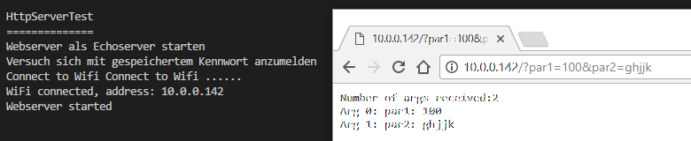

# Library WifiHttpServer

## Ziele

Der ESP wird als Webserver verwendet, dem per Get-Request Befehle geschickt werden können. Um den Webserver von später implementierten Anwendungsmodulen unabhängig zu halten, wird er nach dem Publish/Subscribe-Prinzip implementiert. Beliebige Module können sich per Route am WifiHttpServer (Singleton) mit ihrer Callbackroutine registrieren.

Der WifiHttpServer verwaltet auch die WLAN-Verbindung eigenständig. Er versucht, sich mit den letzten Zugangsdaten anzumelden. Gelingt dies nicht, öffnet er einen eigenen Accesspoint (192.168.4.1), und wartet auf die Übermittlung der Zugangsdaten. Zu diesem Zweck wird die Route /wifi verwendet. Über einen Getrequest auf diese Route können die Zugangsdaten übermittelt werden.

````
http://192.168.4.1/wifi?ssid=SSID&password=PASSWORD
````
Der ESP signalisiert die Bereitschaft zur Übertragung der Zugangsdaten durch ein langsames Blinken der eingebauten LED. Auch die LED-Verwaltung kann über eine eigene Route (led) angesprochen werden.

Eigene Module können sich durch Registrieren einer Route am WifiHttpServer anmelden und so eine einfache Steuerung per HTTP erreichen.


## Hardware

Es wird lediglich ein ESP8266 benötigt.

## Software

### Testanwendung am ESP8266

Ein kleines Testprogramm überprüft die Funktion der Bibliothek. Der ESP empfängt einen Get-Request und gibt als Response den empfangenen Text zurück.

Neben den eingebauten Routen (wifi, led) wird die Rootroute (/) vom Testprogramm abgefragt. Die übergebenen Parameter werden analysiert und im Response der Anfrage zurückgeschickt.


````c
#include <WifiHttpServer.h>

/**
 * Der Root-Subscriber analysiert die übergebenen Parameter
 * und liefert das Ergebnis der Analyse zurück.
 * */
void handleRootTest() {
	
	String message = "Number of args received:";
	message += WifiHttpServer.args();           //Get number of parameters
	message += "\n";                            //Add a new line
	for (int i = 0; i < WifiHttpServer.args(); i++) {
		message += "Arg " + (String)i +  ": ";   //Include the current iteration value
		message += WifiHttpServer.argName(i) + ": ";     //Get the name of the parameter
		message += WifiHttpServer.arg(i) + "\n";              //Get the value of the parameter
	} 
	WifiHttpServer.send( 200, "text/html",message);       //Response to the HTTP request
}


void setup() {
	Serial.begin(115200);                 //Initialisierung der seriellen Schnittstelle
	Serial.println();
	Serial.println();
	Serial.println("HttpServerTest");
	Serial.println("==============");
	Serial.println("Webserver als Echoserver starten");
	WifiHttpServer.init();
	WifiHttpServer.on("/", handleRootTest);
}

void loop() {
	WifiHttpServer.handleClient();
	delay(1);
}
````

#### Testanwendung verwenden

- Mit ESP verbinden
	- Über AP 192.168.4.1/?par1=10
	- Über verbundene WLAN-Verbindung

##### UI der Testanwendung




### Library

#### Eigenen Accesspoint für ESP8266 eröffnen

Wenn keine Konfigurationsdaten zur Verfügung stehen, wird vom ESP8266 ein eigener offener Accesspoint eröffnet. Um verschiedenen ESP8266-APs unterscheiden zu können, wird die Macadresse als Namensbestandteil verwendet.

````c
/*
	Accesspoint mit Mac-Adresse als Namensbestandteil anlegen
*/
void setupAP() {
	Serial.print("Setup AP: ");
	// Build AP name
	uint8_t mac[6];
	WiFi.softAPmacAddress(mac);
	char apName[] = "ESP_000000000000";
	for (int i = 0; i < 6; i++) {
		apName[i * 2 + 4] = getHexChar(mac[i] / 16);
		apName[i * 2 + 5] = getHexChar(mac[i] % 16);
	}
	Serial.println(apName);
	WiFi.softAP(apName, "");
	Serial.print("AP: ");
	Serial.println(apName);
	Serial.print("IP: ");
	Serial.println(WiFi.softAPIP().toString());
	Serial.println("Esp AP waiting on 192.168.4.1/wifi?ssid=SSID_WLAN&password=PASSWORD_WLAN");
}
````

#### WLAN-Zugangsdaten aus Requestparametern übernehmen

Die SSID und das Passwort werden aus den Querystringparametern übernommen und es wird versucht, eine Verbindung zum WLAN aufzubauen. Gelingt dies, fordert die schnell blinkende LED dazu auf, den ESP zu reseten.

````c
/**
 * Verarbeitung der Übermittlung der WLAN-Zugangsdaten
 */
void handleWifiConnectionArgs() { 
	char* ssid =new char[20];
	char* password = new char[20];
	String response = "";
	String ssidPar = WifiHttpServer.arg("ssid");
	String passwordPar = WifiHttpServer.arg("password");
	if (ssidPar.equals("")){     //Parameter not found
		response = "ssid not found";
	}
	else{     //ssid found
		if(passwordPar.equals("")){
			response = " password not found";
		}
		else{
			ssidPar.toCharArray(ssid,19);
			passwordPar.toCharArray(password, 19);
			if(WifiStation.init(ssid, password)){
				Serial.println("Connected!");
				InternLed.errorBlinkOn(); 
				while(true){
					delay(10);
				}
			}
			else{
				response = "connect to wlan failed!";
				Serial.println("connect to wlan failed!");
			}
		}
	}
	WifiHttpServer.send( 200, "text/html", response);          //Returns the HTTP response
}

````

#### WifiHttpServer initialisieren

````c
/*
	Accesspoint definieren und öffnen. Webserver starten und auf Get-Request warten
*/
void WifiHttpServerClass::init()
{
	if(!WifiStation.init()){
		Serial.println("Accesspoint oeffnen");
		setupAP();  // eigenen Accesspoint unter 
		InternLed.normalBlinkOn(); //!		setSlowBlinking();
	}
	delay(100);
	on("/wifi", handleWifiConnectionArgs); 	// WLAN-Zugangsdaten verarbeiten
	on("/led", handleInternLedArgs); // Kommandos für interne LED verarbeiten
	begin();                                       //Start the server
	Serial.println("Webserver started");
}
````


