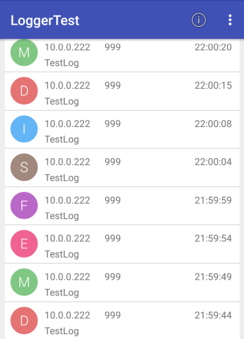

# Library Logger

## Ziele

Einfacher Logger, der Protokollmeldungen per Get-Request an den Server schickt. Neben der Quelle der Logmessage wird auch der Typ, die Zeit und natürlich die Message selbst übertragen.

## Hardware

- ESP8266
- Android-Device

## Software

### Abhängigkeiten

- NodeConfig, um sich mit dem WLAN verbinden zu können
- HttpClient zum Verschicken der Get-Requests

### Logmessage-Typen

	const int SYSTEM = 0;
	const int INFO = 1;
	const int DEBUG = 2;
	const int MEASUREMENT = 3;
	const int EXCEPTION = 4;
	const int FATALERROR = 5;


### Testanwendung am ESP8266

Der Node verbindet sich mit dem WLAN und initialisiert den HttpClient.
In der Loop wird alledrei Sekunden eine Logmessage mit unterschiedlichem Typ (rotierend von System bis Fatalerror) ausgegeben.

#### Testprogramm

````c

#define SERVER_LENGTH 20
char testServer[SERVER_LENGTH];
int testPort;
const uint BUFFER_SIZE = 50;
char request[BUFFER_SIZE];


void setup() {
	Serial.begin(115200);                 //Initialisierung der seriellen Schnittstelle
	Serial.println();
	Serial.println();
	Serial.println("LoggerTest");
	Serial.println("==========");
	Serial.println();
	NodeConfig.setupWifi();
	delay(100);
	if (WifiStation.isConnected())
	{
		NodeTime.setTimeFromNtp();
		delay(100);
		HttpServer.init();
		NodeConfig.getConfigItem("server").toCharArray(testServer, SERVER_LENGTH);
		testPort = NodeConfig.getConfigItem("port").toInt();
		HttpClient.init(testServer, testPort);
		SimpleCommandInterpreter.init();
		NodeConfig.registerNodeConfigCommandCallback();
	}

}

int logType = 0;

void loop() {
	yield();
	SimpleCommandInterpreter.interpretHttpCommand();
	Logger.log(999, logType, "TestLog");
	logType++;
	if (logType > Logger.FATALERROR) {
		logType = 0;
	}
	delay(3000);
}
````

#### Testanwendung verwenden

- Programm uploaden und starten
- Mit seriellem Monitor verbinden
	- Bei Bedarf Konfiguration WLAN und Server durchführen
- Android-Server App LoggerTest starten

#### UI der Testanwendung im seriellen Monitor des Nodes

````
Opening port
Port open
?

LoggerTest
==========
Read Config from SPIFFS
Connect to Wifi ..
WiFi connected, address: 10.0.0.222
Wifi is connected
Starting UDP
Local port: 8888
waiting for sync
Transmit NTP Request
at.pool.ntp.org: 144.76.197.108
Receive NTP Response
Transmit NTP Request
at.pool.ntp.org: 194.208.181.70
Receive NTP Response
Simple Webserver started, Status: 1
CommandInterpreterClass::init()
Request an Server
GET /?TYPE=0&&COMPONENTID=999&&TIME=1503498767&&MESSAGE=TestLog
Ok: 1
Response: 1
Request an Server
GET /?TYPE=1&&COMPONENTID=999&&TIME=1503498771&&MESSAGE=TestLog
Ok: 1
Response: 1
````

#### Library

#### Optimierungsmöglichkeiten

- Logs am ESP im RAM oder im Flash-Filesystem puffern, falls die Verbindung zum Server nicht besteht.
	- Nach Aufbau der Verbindung zum Server, Logs an Server schicken.

#### Headerdatei Logger.h

````c
class LoggerClass
{
protected:


public:

	/*
		Ein Logeintrag mit folgenden Parametern wird zum Server geschickt:
		type: Typ der Logmessage (Info - Fatalerror)
		id: Id der Komponente (Sensor, Actor, Controller, ...)
		time: Unix-Timecode
		message: Logtext
	*/
	void log(int id, int type, String message);

	const int SYSTEM = 0;
	const int INFO = 1;
	const int DEBUG = 2;
	const int MEASUREMENT = 3;
	const int EXCEPTION = 4;
	const int FATALERROR = 5;

};

extern LoggerClass Logger;
````

### Testanwendung Android LoggerTest

Unter Android verwendet die Gegenstelle (LoggerTest) den HttpServer als Service. Ankommende Logeinträge werden in das Repository übertragen und per Observerpattern an die GUI weitervermittelt.

Komponenten der Umsetzung
- MainActivity initialisiert App
	- Startet HttpServer als Service im Hintergrund
	- Beobachtet den "Datendrehscheibe" (Repository) und gibt bei Änderung der Daten diese über einen Handler aus
	- Ausgabe erfolgt über eine Recyclerview mit CardView
		- Zur Ausgabe von Textsymbolen wird die Library TextDrawable verwendet
- Repository verwaltet die Daten und verständigt die Mainactivity

### UI der Androidanwendung LoggerTest

