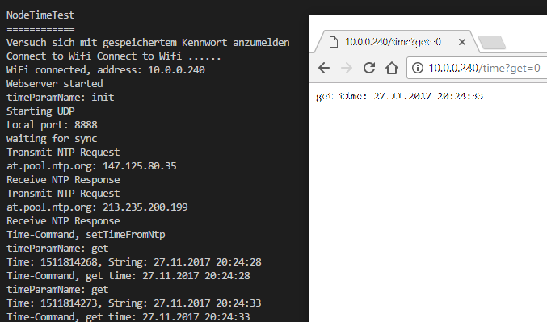

# Library NodeTime

## Ziele

Verwaltung der Zeit für den Node. Die Synchronisation erfolgt über NTP-Server im Internet. Die lokale Zeit wird über eine Erweiterung der Standardlibrary time implementiert.

## Hardware

ESP8266

## Software

### Abhängigkeiten

- NodeConfig, um sich mit dem WLAN verbinden zu können
- WifiHttpServer als UI für die Bedienung der Library

### Testanwendung am ESP8266

Der Node verbindet sich mit dem WLAN und ermittelt die Zeit über einen NTP-Server.
Über die Route time des Httpservers kann das Testprogramm wie folgt bedient werden:
- /time/init=0	Initialisierung der Verbindung zum NTP-Server
- /time/get=0	Auslesen der aktuellen Uhrzeit

#### Testprogramm

````c
#include <WifiHttpServer.h>
#include <NodeTime.h>

/**
 * Die Ntp-Verbindung wird getestet
 * 		/time/init=0	initialisiert die NTP-Vrebindung
 * 		/time/get=0		liest die aktuelle Zeit aus
 */
void handleNtpRequest() {
	String response = "";
	if(WifiHttpServer.args() > 0){
		String timeParName = WifiHttpServer.argName(0);
		Serial.println("timeParamName: "+timeParName);
		if(timeParName.equals("init")) {
			NodeTime.setTimeFromNtp();
			response="setTimeFromNtp";
		} else if (timeParName.equals("get")) {
			Serial.print("Time: ");
			Serial.print(NodeTime.getDateTime());
			Serial.print(", String: ");
			String stringDateTime = NodeTime.getStringDateTime();
			Serial.println(stringDateTime);
			response="get time: "+stringDateTime;
		}
	}
	else{
		response = "time-command no parameter found";
	}
	Serial.println("Time-Command, "+response);
	WifiHttpServer.send( 200, "text/html", response);          //Returns the HTTP response
}

void setup() {
	Serial.begin(115200);                 //Initialisierung der seriellen Schnittstelle
	Serial.println();
	Serial.println();
	Serial.println("NodeTimeTest");
	Serial.println("============");
	WifiHttpServer.init();
	WifiHttpServer.on("/time", handleNtpRequest);

}
void loop() {
	WifiHttpServer.handleClient();
	delay(1);
}
````

#### Testanwendung verwenden

- Programm uploaden und starten
- Mit seriellem Monitor verbinden
	- Bei Bedarf Konfiguration WLAN und Server durchführen
- Über Browser /time/init und /time/get verwenden

#### UI der Testanwendung im seriellen Monitor des Nodes



#### Library

##### Verwendung der Library time.h/time.cpp

Diese Library (aus dem Internet) verwendet trickreich eine Hilfsdatei TimeLib.h um den Zugriff auf die im Android-Bibliothekssystem enthaltene Library time.h "auszublenden". Indem alle drei Dateien mit der Bibliothek NodeTime ausgeliefert werden, kann man mit dem "Hack" leben.

#### Optimierungsmöglichkeiten

- Die Adresse des Ntp-Servers ist derzeit fix codiert
	- Setzen über die Config oder einen Web-Request
- Zeitzone ist derzeit fix auf Mitteleuropa eingestellt
	- Auch hier könnte Config verwendet werden.

#### Headerdatei NodeTime.h

````c
class NodeTimeClass
{

public:

	/*
		Setzt einen NTP-Time-Subscriber, der im vorgegebenen Intervall die
		lokale Zeit mit der NTP-Zeit synchronisiert.
	*/
	void setTimeFromNtp();

	
	/*
		Liefert die UNIX-Zeit als long zurück
	*/	
	time_t getDateTime();

	/*
		Setzt die interne Zeit
	*/
	void setTime(time_t);

	/*
		Liefert Datum und Uhrzeit im mitteleuropäischen Format zurück
	*/
	String getStringDateTime();

};

extern NodeTimeClass NodeTime;
````
