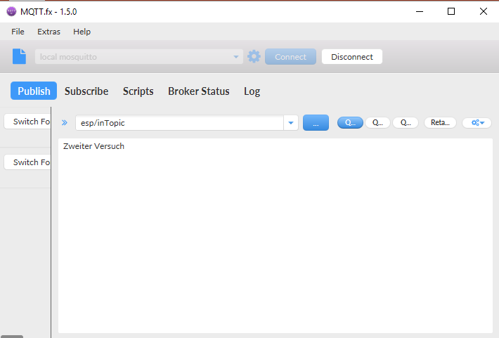

# Mqtt
Mqtt definiert die Konzepte zweier Verbindungspartner: Publisher und Subscriber. Ein Publisher meldet sich immer dann zu Wort, wenn sich irgendein Wert ändert, oder wenn er irgendeine entfernte Aktion ausführen möchte. Der Subscriber horcht auf gewisse Meldungen und kann dann entsprechend reagieren, wie zum Beispiel die Aktion, die der Publisher ausführen möchte, auszuführen. Diese gesamte Kommunikation geht über eine Zentrale, den sogennanten "Broker".

### Eigenschaften des MQTT-Protokolls
#### Geringer Bandbreitenbedarf
Da die Verbindung über TCP geht und möglichst lange offen gehalten wird, sind die gesendeten Pakete schlank. Damit eignet es sich auch gut bei Systemen, wo die Netzwerkleistung begrenzt ist (z.B Mikrokontrollern)
#### Absturzsicher
Durch die spezielle Architektur, und den geringen Bandbreitenbedarf macht auch eine schlechte Internetverbindung nichts. Wenn ein Verbindungspartner kurzzeitig ausfällt, kann er sich einfach wieder neu verbinden, als wäre nichts geschehen.
#### Leichtgewichtig
Nicht nur das Protokoll ist klein, sondern auch der Aufwand der nötig ist um es zu implementieren. Durch diese Eigenschaft können kleine Libraries geschrieben werden, die auf Mikrocontroller und Embedded Devices passen.
#### Publish-Subsrcibe Pattern
Um die Daten in Kategorien einzuteilen haben alle Meldungen eine "Topic". Diese ist meist hierarchisch (z.B `sensor/garten/wasserstand`) aufgebaut, kann aber auch eine beliebige andere Struktur haben. Die Daten die über einen Publish gesendet werden sind in keinser Weise strukturiert, und können daher komplett an den Anwendungsfall angepasst werden.

Für weitere Infos über MQTT siehe [diesen Artikel auf Heise.de](https://www.heise.de/developer/artikel/Kommunikation-ueber-MQTT-3238975.html)

## Nützliche Software
### Eclipse Paho
[Eclipse Paho](https://www.eclipse.org/paho/) ist eine open-source MQTT-Implementierung der Eclipse-Foundation. Sie ist erhältlich für viele Sprachen, darunter Java, C++, Python, ... und ist auch für Android und embedded C/C++ erhältlich.

### Mosquitto
Für eine MQTT-Architektur braucht man immer einen Broker, der sich um die Verteilung der Daten kümmert. Auch ein steht gratis bereit. [Mosquitto](https://mosquitto.org/) ist ein open-source MQTT-Broker der Eclipse-Foundation welcher für Mac, Windows und nahezu alle Linux-Systeme erhältlich ist.

Leider ist die Installation unter Windows nicht sehr leicht, da er abstürzen kann. Genauere Instruktionen dafür, finden sich in der beigelegten [Powerpoint](./mqttpublishersubscriber.pptx)

### MQTT.fx
Um Mqtt-Systeme zu entwickeln braucht man oft eine Möglichkeit um zu testen ob es auch funktioniert. Dazu gibt es einen Fertigen MQTT-Client mit Gui, geschrieben in Java. [MQTT.fx](http://mqttfx.jensd.de/) basiert auf oben genanntem Eclipse-Paho und ist - dank Java - für ziemliche alle Betriebssysteme erhältlich

Mit diesem Programm können Daten gepublisht werden.

Auch Subscriber sind möglich:

### PubSubClient
[PubSubClient](https://github.com/knolleary/pubsubclient) stellt eine gut dokumentierte MQTT-Client-Implementierung auf einem Arduino-Kompatiblen System dar. Auch Beispielcode ist am [Git-Repo](https://github.com/knolleary/pubsubclient) erhältlich.

# MqttClient-Library

Die MqttClient-Library stellt ein einfaches API für das Mqtt Protokoll bereit. Sie baut auf der oben genannten PubSubClient-Library auf und lässt sich einfach, über ein Singleton-Interface steuern.

Für weitere Informationen zu dieser Library siehe das [Readme](../../libraries/MqttClient/README.md)